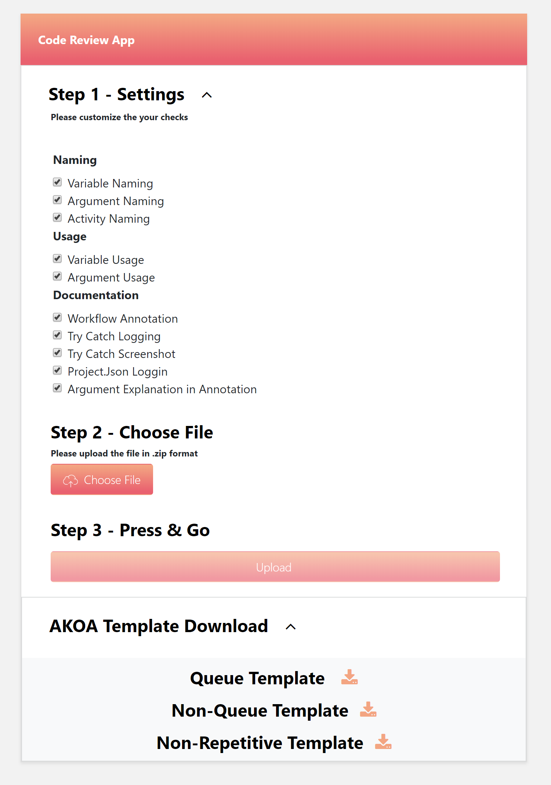

# Python Flask sample for Azure App Service (Linux)

This is a minimal sample app that demonstrates how to run a Python Flask application on Azure App Service on Linux.

<<<<<<< HEAD
For more information, please see the [Python on App Service quickstart](https://docs.microsoft.com/en-us/azure/app-service/containers/quickstart-python).
=======
- Naming
- Variable Naming
- Argument Naming
- Activity Naming
- Usage
- Variable Usage
- Argument Usage
- Documentation
- Workflow Annotation
- Try Catch Logging
- Try Catch Screenshot
- Project.Json Logging
- Argument Explanation in Annotation 

The goal is to help develop better code by offering guidelines for development as well as giving the uploader a score from **1 to 100?**. The grading criteria can be customized/enabled/disabled to various coding standards and best practices to better suit the development team using this software. 

### Upload Scren

### Results Screen

The sections on the screenshot are described as follows:

## Score
## Workflow Invocation Network
## Project Overview
## Details
## Project Compliance Backlog
## Selectors Overview
## Activity Statistics
## Project File Structure
>>>>>>> parent of 0ab22da0... Update README.md

# Contributing

This project has adopted the [Microsoft Open Source Code of Conduct](https://opensource.microsoft.com/codeofconduct/). For more information see the [Code of Conduct FAQ](https://opensource.microsoft.com/codeofconduct/faq/) or contact [opencode@microsoft.com](mailto:opencode@microsoft.com) with any additional questions or comments.
