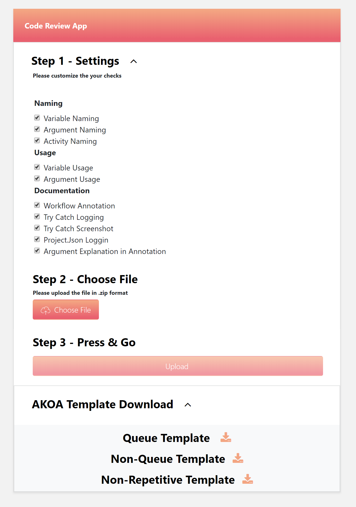
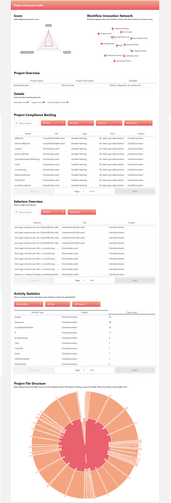

# Sleipnir

Link!
[http://sleipnir.azurewebsites.net](http://sleipnir.azurewebsites.net)

This program is a code grading tool for the UiPath software suite. It intakes .xaml files from UiPath Studio projects (as a project zip file) and analyzes various metrics about the uploaded code including:

- Naming
- Variable Naming
- Argument Naming
- Activity Naming
- Usage
- Variable Usage
- Argument Usage
- Documentation
- Workflow Annotation
- Try Catch Logging
- Try Catch Screenshot
- Project.json Logging
- Argument Explanation in Annotation 

The goal is to help develop better code by offering guidelines for development as well as giving the uploader a score from 1 to 100?. The grading criteria can be customized/enabled/disabled to various coding standards and best practices to better suit the development team using this software. 
By default this program utilizes UiPath best practices according to the PDF in the root of the repository

### Upload Scren

### Results Screen

The sections on the screenshot are described as follows:

## Score
A radar chart rates your codes competency out of 100 in the following areas:

Usage - Consistent variable usage according to UiPath best practices PDF 
Documentation - properly commenting your code with a description
Naming - Variable naming patterns according to UiPath best practices PDF 

## Workflow Invocation Network
This linked graph shows every workflow in the project and which workflow calls it. It is easy to find which calling workflow to reference, and if there is any circular logic within your code. 

## Project Overview
This part of the report looks at the header information of your project and tells whether it is a dispatcher or performer, what the project description is, and displays the title of the project. 

## Details
WIP

## Project Compliance Backlog
This section displays all problematic variables in the project organized by the workflow in which they appear. For each variable the type is displayed as well as the nature of the error and the project which it belongs to. 

## Selectors Overview
This section lists all the selectors present in the project by file. The selector can be reviewed and graded here. 

## Activity Statistics
This section lists all of the activities invoked in the project in descending order by number of usages. 

## Project File Structure
This visual represents every single file in the uploaded zip archive and how much file space each file takes up relative to every other file. 
